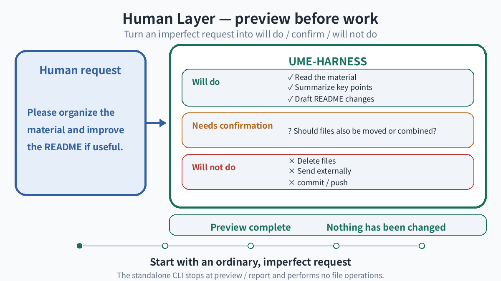
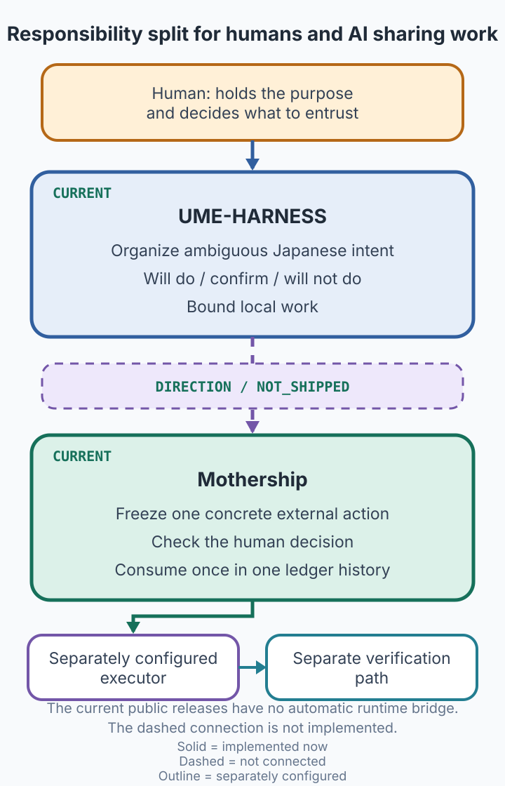
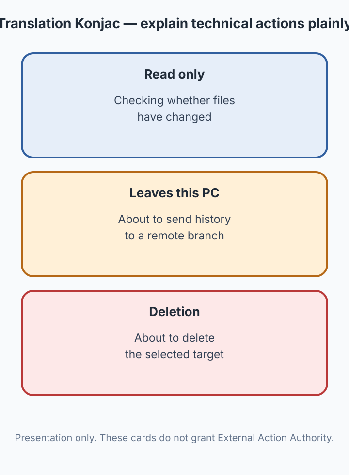

# UME-HARNESS

> Unpublished v0.1.7 candidate; final-candidate interactive acceptance is pending.
> An earlier candidate is in local use. Local usability
> feedback does not establish behavior of the public package without personal settings.

[日本語](README.md) · Technical Preview · v0.1.7 (unpublished candidate) · [Previous v0.1.6](https://github.com/UMEBOSHIISAN/ume-harness/releases/tag/v0.1.6)

This README describes the v0.1.7 development candidate. v0.1.6 verification is
identified as historical evidence. The integrated Pillow update and documentation
corrections are also absent from the published v0.1.6 tag and distribution.

[](https://github.com/UMEBOSHIISAN/ume-harness/actions/workflows/ci.yml)

<p align="center">
  
</p>

> Start with an ordinary, imperfect request.
>
> Before work proceeds, make visible what may proceed without confirmation,
> what needs confirmation, and what has not run yet.

UME-HARNESS is a local work harness designed around Japanese-language requests
for AI coding agents.

It currently provides a standalone Human Layer preview CLI and a
Claude Code Host Adapter for explaining and bounding local work.

The standalone CLI presents a plan; it does not perform file operations.
Ease of adoption for non-engineers remains under evaluation.

<p align="center">
  <picture>
    <source media="(prefers-reduced-motion: reduce)" srcset="assets/readme/en/ume-harness-human-layer-poster.png">
    <source media="(max-width: 600px)" srcset="assets/readme/en/ume-harness-human-layer-poster.png">
    
  </picture>
</p>

The GIF explains the standalone CLI preview surface.
Reduced-motion settings and screens up to 600px use the equivalent vertical static poster.

## PURPOSE

People should not need to write machine-perfect instructions before asking for
help. UME-HARNESS organizes an ordinary request into a scope that can be
reviewed before an AI coding agent begins local work.

It is a local-work plane for making visible what may proceed without
confirmation, what needs confirmation, and what has not run yet—without
requiring a person to micromanage everything or hand over all control.

## What changes in the v0.1.7 candidate

- Standard setup connects two Japanese presentation hooks for permission requests and failures. Claude Code retains native permission decisions for ordinary work.
- Explanations avoid echoing raw command arguments and paths, and distinguish confirmation, refusal, and evaluation errors.
- Settings updates stop on detected conflicts, and forced replacement of an existing installation is refused.

Conservative Lease enforcement requires explicit `--managed` setup. Details and migration steps follow below.

## What changed in v0.1.6

The Claude Code adapter now handles the flow of loading tool definitions, asking
a question, and reviewing a work plan.

- `ToolSearch` returns control to Claude Code instead of being blocked as an unknown tool. Each subsequently invoked tool still receives its own permission check.
- Claude Code owns questions and plan approval through `AskUserQuestion` and `ExitPlanMode`. The harness does not answer or approve on your behalf.
- An installed v0.1.6 candidate was exercised through questions, plan review, reading, writing, and failure notification. The `EnterPlanMode` interaction was observed; emission of its PreToolUse event was not established.

See the [support matrix](SUPPORT_MATRIX.md) for the measured scope and features
that are not connected to the host lifecycle.

### Maintenance in this branch

Pillow changes from 11.3.0 to 12.3.0. It is a development dependency for generating
README images, not a dependency of normal installation or CLI execution. All
eight regenerated images are byte-identical to the previous outputs. This update
does not add work-execution or automatic-approval features.

## Current implementation

This candidate has two distinct surfaces.

### Human Layer preview CLI

It shows candidate actions that may proceed without confirmation, actions that
require your confirmation, and any questions that must be answered first.
The standalone CLI stops at preview/report and does not perform file operations.

The CLI calls `claude -p --model sonnet`; it does not pin an exact model version.
The distribution does not include raw runs needed to recheck interpretation
accuracy, so no accuracy guarantee is made. An offline path accepts stored JSON
without an API call.

### Claude Code Host Adapter

The adapter handles local leases and worktree, path, and capability boundaries
for Claude Code. Its three hooks and Lease Gate have static and integration tests.

Claude Code is the first integrated and validated Host Adapter. In v0.1.6,
interactive physical live E2E was demonstrated from installed exact candidate
bytes. Non-interactive `claude -p`, MCP execution, and arbitrary unknown-tool
pass-through remain outside this release's claims.

## Responsibility split with Mothership

UME-HARNESS turns human intent into a bounded local-work preview.
Mothership binds a human decision to bounded authority for one external action.

<p align="center">
  
</p>

The current public releases have no automatic runtime bridge. The dashed connection is not implemented.
UME-HARNESS holds no external consequential authority and does not automatically invoke Mothership.

## Preview Quick Start (published v0.1.6)

```bash
git clone --branch v0.1.6 --depth 1 https://github.com/UMEBOSHIISAN/ume-harness.git
cd ume-harness
./scripts/install.sh

~/.local/bin/ume-harness "Please summarize the material in this folder and improve the README if needed" \
  --context "The current folder contains three documents and README.md."
```

The normal path requires an authenticated Claude CLI and network access. It
sends the request and context to Claude for interpretation. The standalone CLI
does not perform the requested file operations or consequential actions.

Offline check without an LLM call:

```bash
~/.local/bin/ume-harness --llm-output-file <path-to-json>
```

A historical input/output example is in [examples/basic_usage.md](examples/basic_usage.md).

## Explain tool activity in human language

Translation Konjac is a presentation-only layer that describes tool events in
human-readable language. The cards below explain reading, leaving the PC, and
deletion using meanings from the current language pack.

<p align="center">
  
</p>

This presentation does not issue permission or become External Action Authority.
In standard connection, an unclassified explanation does not decide permission,
refusal, or an additional confirmation. Whether confirmation is required remains
Claude Code's decision under its native permission settings.

## Install and connect Claude Code

### Install the candidate

Run the following from a verified v0.1.7 candidate checkout. The Quick Start above
fetches the older v0.1.6; do not combine it with these candidate connection and
diagnostic steps. The candidate is unpublished, so no public download command
is available yet.

```bash
./scripts/install.sh
```

The default prefix is `~/.local`. If the command is not on `PATH`:

```bash
export PATH="$HOME/.local/bin:$PATH"
```

To update from v0.1.6 to the v0.1.7 candidate, use the new source checkout to verify and
remove the old release before installing the new one. Replacement of an existing
installation, including same-version `--force`, is rejected before mutation.
A fresh install into a separate prefix remains available. Uninstall also
disconnects UME-owned hooks; default setup's preservation of managed connections
does not mean they survive an update workflow that includes uninstall.

```bash
./scripts/uninstall.sh --version v0.1.6 --settings-path "${HOME}/.claude/settings.json" --yes
./scripts/install.sh
```

### Connect and disconnect Claude Code

Package installation does not modify existing Claude Code settings.
Connection is explicit:

```bash
ume-harness setup --yes
```

The development candidate defaults to two presentation-only hooks: permission
requests and failures. Ordinary Python, search and external reads retain Claude
Code's native permission handling; no UME execution gate is registered.
**Standard connection does not enforce execution restrictions.** It neither
enforces UME Lease/path constraints nor changes native permissions. Permission to
use a tool is not approval for this request's scope. Request text and operating
instructions still apply, but this connection alone does not guarantee prevention
of unrequested implementation or consequential actions. Managed checks cover only
their supported representations, not the full meaning of human intent.
Choose `ume-harness setup --managed --yes` explicitly for conservative Lease
enforcement. Default setup preserves an existing managed connection but never
restores a removed PreToolUse. Disconnect first to switch managed to presentation.

### Migrate an older three-hook connection

Installing or running default setup alone does not remove existing enforcement.
Before uninstalling the old release, disconnect with its own CLI:

```bash
"$HOME/.local/bin/ume-harness" setup --disconnect
```

Then uninstall the old release, install the new release, and run
`ume-harness setup --yes` without `--managed`. For a same-prefix connection-only
change, run default setup immediately after disconnect. Keep custom prefixes and
settings paths consistent throughout. Open a new CC session and check that the
registration diagnostic reports `presentation`; file inventory does not prove
that a running host reloaded its settings.

Only UME-owned hooks are removed. Other hooks, native permissions, personal
RUNBOOKs and local rules are neither disabled nor distributed. Environments with
other gates are not promised identical behavior.

Disconnect:

```bash
ume-harness setup --disconnect
```

Setup/disconnect owns only exact matches for the three canonical hook commands
it generated. It does not touch other events, matchers, or hooks, and stops if
the settings cannot be parsed and revalidated safely.

UME setup/disconnect writers (including uninstall's disconnect) use a persistent
sidecar with the `.ume-harness.lock` suffix beside the settings file. Contention
ends without applying the requested change; there is no automatic retry, merge,
or restoration of an old backup. Detected external changes before saving stop
the write. A mismatch detected after replacement is reported as an unconfirmed
post-commit outcome. Do not replace or remove the lock file.
This advisory lock does not control non-cooperating CC/editor writers. A race
window remains between the final comparison and replacement: do not edit the
same settings elsewhere during connection/disconnection. This applies only to
the short settings update, not ordinary CC tool execution.

### Diagnose and uninstall

```bash
python3 ~/.local/lib/ume-harness/v0.1.7/scripts/health_check.py
# or, from the repository
python3 ./scripts/health_check.py

./scripts/uninstall.sh --settings-path "${HOME}/.claude/settings.json" --yes
```

Use the same custom settings path and prefix for setup and removal.
Uninstall verifies owned hooks and payload, preserves unrelated Claude settings,
and keeps `~/.ume-harness/state`.

### Diagnostic and presentation scope

`connected_mode` inventories only the specified settings file.
`session_hook_recognition` and `actual_hook_event` separately remain unknown until
verified in the target CC session and actual permission/failure events. Inspect
that session's hooks; restart if changes are not reflected. Other settings sources
are outside this inventory.

The two presentation hooks do not explain every operation or every error.
Non-interactive/background operation and pre-execution refusals may not trigger
them. UME's `--managed` does not mean Claude organization-managed settings;
policies such as `allowManagedHooksOnly` may prevent user hooks from loading.

New presentation entries use Claude's native timeout mechanism with a UME default of three seconds, without retry.
Existing timeout values, including absence, are preserved and differences reported.
To adopt that bound for existing entries, inspect the target and disconnect then
run default setup. Other hooks and organization policies are not removed. The
local user's separately adjusted Stop/native-permission rules are not distributed.
See [Claude hooks](https://code.claude.com/docs/en/hooks) and
[settings](https://code.claude.com/docs/en/settings).

## Current limitations

- UME-HARNESS is not an OS sandbox; it assumes a trusted host entrypoint.
- Standard connection does not enforce UME Lease/path restrictions; native host permissions remain in charge.
- `--managed` is conservative: general network, arbitrary Python and unknown-tool execution are not supported promises.
- Managed targets with multiple hard links are refused. Path checks are not race-free OS isolation.
- The standalone Human Layer CLI is preview/report only and does not execute local work.
- Resume after an approval-required Claude operation is not wired to a confirmation-token path.
- Expected-state, concurrent, and out-of-band mutation primitives are not wired into the Claude host lifecycle.
- The isolated lifecycle is measured on macOS arm64. Linux/POSIX is expected but unverified; Windows native is unsupported.
- Secret detection for OS pseudo-files is not comprehensive.
- Identity authentication, RBAC, external executors/verifiers, retries, and daemons are not provided.
- There is no Mothership ConsequenceProposal producer or runtime bridge.
- Non-engineers are a primary design audience, but adoption ease remains under evaluation.

## Source and release boundary

`ume-harness-engineering` is the only canonical source. Public `ume-harness` is
a generated release mirror built from an explicit closure; public-side edits
and public-to-engineering reverse synchronization are unsupported.

The machine-readable release closure is `release.payload` in
[package_manifest.json](package_manifest.json); [MANIFEST.md](MANIFEST.md)
is its readable listing. `scripts/release_promote.py` performs one-way staging,
identity generation, tests, and mirror comparison. It does not publish or push.

The installed payload has a frozen byte identity. Installation provenance still
assumes a trusted canonical/generated-release checkout and is not an independent
signature verifier.

## Technical documentation

The packaged Human Layer README, contracts, and prompts describe the design.
Their proceed/revise/cancel interaction, work execution, and post-work report
are not an implemented end-to-end standalone CLI workflow. For implemented
behavior, use “Current implementation” above and the [support matrix](SUPPORT_MATRIX.md).

- [Human Layer (published v0.1.6 design material)](ux/japanese-human-layer/README.md)
- [Claude Code adapter](adapters/claude-code/README.md)
- [Authority contract](contracts/authority_contract.md)
- [Tool policy](contracts/tool_policy.md)
- [Support matrix](SUPPORT_MATRIX.md)
- [Security boundary](SECURITY.md)
- [Release manifest](MANIFEST.md)

Run the complete local suite:

```bash
python3 -m pytest -q -p no:cacheprovider tests ux/japanese-human-layer/tests
```

## License

The project code is MIT; see [LICENSE](LICENSE) and [NOTICE](NOTICE). The bundled
Noto Sans JP font used to generate README assets remains under the
[SIL Open Font License 1.1](assets/readme/source/fonts/OFL-1.1.txt).
