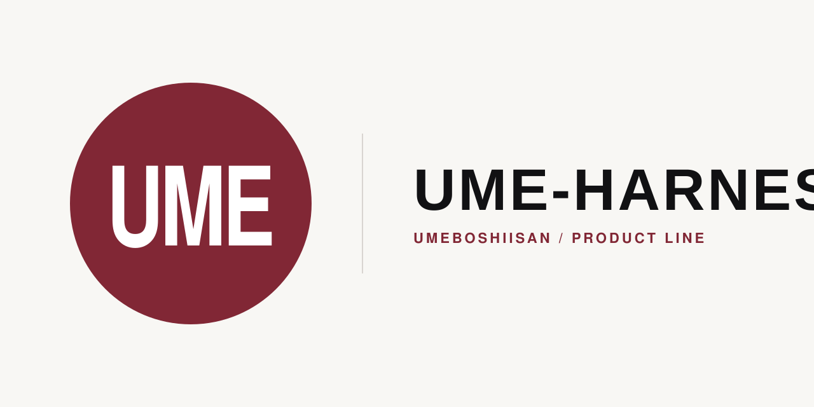

<p align="center">
  
</p>

# UME-HARNESS (Portable Edition)

> **Deterministic Local Work Governance for AI Coding Agents**
> Portable Local-Execution Policy / Host Adapter + local Japanese safety-explanation surface (Translation Konjac)
> 日本人の非エンジニアが自然な日本語で安全に仕事を任せられる、オープンソースの
> ローカル作業の確認・安全判定基盤および作業ツリー実行権限制御アダプタ。

## 📌 現在のステータス（v0.1.0・2026-08-26 corrective candidate）

- **製品の位置づけ**:
  本パッケージは、local `tool_policy` / Lease Gate を提供する **HOST_ADAPTER** と、
  技術イベントを平易な日本語へ変換する Presentation adapter です。canonical な外部
  Action Authority / FrozenAction は所有せず、外部 Authority は Mothership が所有します。
  三製品の境界は **UME-HARNESS = Local Work Plane**、
  **UME Persona = Persona / Presence Plane**、
  **Mothership = Consequential Authority Plane** です。Translation Konjac は
  Harness内のpresentation-onlyな安全説明面であり、UME Personaやauthority sourceではありません。
  三製品間のruntime integrationはありません。
  **※ 完全自動で外部操作まで完結する Turnkey 秘書アプリや、無人自律実行エンジンではありません。**
- **Semantic interpretation**: CLIはClaude Sonnet 5を呼ぶ構成です。ただし現行releaseから
  raw semantic runへ到達できないため、モデル精度を「保証」とは表現しません。
  Gemma 4:12bはv0 CLI経路の対象外です（詳細: `SUPPORT_MATRIX.md`）。
- **単一CLI入口**: `ume-harness`（`bin/ume-harness`）。日本語の依頼文を渡すと、
  local Authority Overlay + Clarification Impact Contract の判定結果と、
  Presentation-only Translation Konjac の説明を自然語で表示する。
- **Claude Code 境界保護アダプタ**: `adapters/claude-code/pretooluse_hook.py` + `lease_gate_runner.py`。
  path/Tier、persisted `edit` capability、Active Lease下の作業ツリー境界、Bash合成攻撃、
  `.ume-harness/**`保護を単体・結合テスト済み。3-hookのstructured outputもstatic test済みですが、
  exact candidate bytesでのphysical live Claude E2Eは別Gateです。
- **インストーラ・ライフサイクル**: isolated HOME/PREFIXで
  install → setup → offline use → byte verify → disconnect → uninstall と最終状態を機械検証済み。
- **Source authority**: `ume-harness-engineering`だけがcanonical source。
  public `ume-harness`は明示closureから生成するrelease mirrorであり、public側の手修正や
  public→engineering逆同期はサポートしない。

---

## 🌟 主な特徴

1. **日本人の非エンジニア向け UX（Japanese Human Layer）**:
   「これいい感じにしといて」「前みたいにお願い」といった曖昧な指示を安全に解釈。
   専門用語を画面に出さず、「やること / しないこと」を自然語で提示。
2. **確認の一括化（clarification / confirmation batching）**:
   不足情報を細切れに質問せず、最初に1回でまとめて確認。
3. **Authority Overlay & Local Execution Lease**:
   危険な削除コマンドや外部送信を自動検知し、人間の明示承認なしには実行させない。
   Active Lease 下では作業ツリー外への Read/Write および `.ume-harness/**` 改ざんを決定論的に遮断する（`contracts/authority_contract.md`）。
4. **Clarification Impact Contract**:
   「人間に確認すべきか」を、6次元の構造化impact判定＋fail-safe原則で決定論的に導出
   （`design/clarification_impact_contract_v0.md`）。

`LeaseStateStore`にはexpected-state / concurrent / out-of-band mutation検知primitiveが
実装されていますが、現行Claude adapterはobserver付きoperation begin/completeへ未結線です。
この機能をClaude host上でenforcedとは主張しません。
`test` capabilityと`test_profile`もLease stateへ保存されますが、profileから許可コマンドへ
変換するClaude host mappingは未実装です。未知のtest commandは承認要求のままです。

---

## 🛡️ 脅威モデルと信頼前提 (Threat Model)

- **Trusted Host Entrypoint Prerequisite**: インストールされた Claude Code エントリポイント（`pretooluse_hook.py`）は信頼されたホスト前提として動作します。同一 UID プロセスや手動によるエントリポイント自体の直接改変・置換は防御対象外です。
- **In-Scope (防護対象)**:
  - Active Lease 下での Claude Code による作業ツリー外ファイルアクセス（Read / Write / cat / head / grep スコープ逸脱）
  - シェルインジェクションおよびコマンド合成攻撃（`;`, `&&`, `||`, `$()`, リダイレクト等）
  - `<worktree>/.ume-harness/**` コントロールプレーン領域の改ざん
  - 非承認の外部副作用（`git push`, `ssh` 等）および破壊的操作（`rm -rf` 等）
  - 40-file explicit install closure のactual bytesとfrozen release identityの一致検証

---

## 🚀 インストールとクイックスタート

### 1. インストール

```bash
git clone https://github.com/UMEBOSHIISAN/ume-harness.git
cd ume-harness
./scripts/install.sh
```

デフォルトで `~/.local`（実行ファイル: `~/.local/bin/ume-harness`）にインストールされます。
上記public repositoryは利用者向けgenerated release mirrorです。変更の正本は
`ume-harness-engineering`であり、public mirrorを編集元にはしません。

#### PATH の確認
インストール後に `ume-harness` コマンドが見つからない場合は、以下を実行してください：

```bash
export PATH="$HOME/.local/bin:$PATH"
```

---

### 2. 重要: Package Install ≠ Claude Code Host Activation

`install.sh` は `ume-harness` 本体と標準アダプタ資産を配備しますが、**既存の `~/.claude/settings.json` やフックを自動変更・上書きすることはありません**。

Claude Codeとの接続:

```bash
ume-harness setup --yes
```

切断:

```bash
ume-harness setup --disconnect
```

setup/disconnectが所有するのは、`PreToolUse` / `PermissionRequest` /
`PostToolUseFailure`にsetup自身が生成する3本のcanonical commandとの完全一致だけです。
他event、他matcher、他hook、および単に`ume-harness`という文字列を含むユーザーhookには
触れません。切断時にsettingsを安全に解析・再検証できない場合はfail closedになります。

---

### 3. CLI の使用（対話1回分の依頼を処理する）

```bash
# Claude Sonnet 5（claude CLI）が必要。モデル精度claimの境界はSUPPORT_MATRIX.md参照
ume-harness "このフォルダの資料まとめて、必要ならREADMEもいい感じに直しといて" \
  --context "現在の作業フォルダ: ~/Documents/資料/ 。中身は doc1.pdf, doc2.pdf, doc3.pdf, README.md の4件のみ。"
```

保存されたhistorical入出力例（current acceptance evidenceではない）: `examples/basic_usage.md`

オフラインテスト（API呼び出しなし。既存のLLM出力JSONを直接渡す）:
```bash
ume-harness --llm-output-file <path-to-json>
```

---

### 4. 診断とアンインストール

インストール状態の診断（ヘルスチェック）:
```bash
python3 ~/.local/lib/ume-harness/v0.1.0/scripts/health_check.py
# または、リポジトリ内から:
python3 ./scripts/health_check.py
```

アンインストール（インストール済みreleaseから実行）:
```bash
~/.local/lib/ume-harness/v0.1.0/scripts/uninstall.sh --yes
```

uninstallはpayload削除前にownership-scoped disconnectを実行します。settingsを解析できない、
またはowned hookが残る場合は、インストールを削除せず停止します。

---

### 5. テスト実行

```bash
python3 tests/test_portable_core.py
python3 tests/test_human_layer_adapter.py
python3 tests/test_cli.py                    # LLM不使用
python3 tests/test_claude_code_adapter.py    # LLM不使用
pytest -q tests ux/japanese-human-layer/tests
```

`tests/test_release_lifecycle.py`はisolated HOME/PREFIXで最終シーケンスを実行し、
payload/CLI/owned hooksの消滅、無関係Claude設定の保持、user stateの保持をassertします。

### さらに詳しく

- 意思決定ロジックの詳細契約: `contracts/authority_contract.md` / `contracts/tool_policy.md`
- 日本語UXレイヤーの詳細: `ux/japanese-human-layer/README.md`
- 対応モデル・実測根拠: `SUPPORT_MATRIX.md`
- Rev.2設計の全文（FROZEN）: `design/clarification_impact_contract_v0.md`

---

## ⚠️ 既知の制約（Known Limitations）

```yaml
overwrite_is_destructive:
  内容: 既存ファイルの内容を上書きする操作は DESTRUCTIVE に分類される
        （削除と同じ扱い＝承認要求）。安全側の設計であり意図的。
  影響: 「更新」のつもりでも承認が求められる場合がある

lexical_keyword_matching:
  内容: Authority Overlayの候補action分類は単純な部分文字列一致であり、形態素解析はしない
        （例: 「読み込む」は「読み込み」というkeywordと厳密一致しないためUNKNOWN扱いになる）
  影響: fail-closedのため安全上の問題はないが、動詞の活用形によって過剰に
        承認要求されることがある
  実例: examples/basic_usage.md「観察」節

work_type_null:
  内容: LLMがwork_type（RESEARCH/EDIT_CREATE/ORGANIZE）を確信を持って選べない場合、
        `work_type: null` + `classification_status: "UNRESOLVED"` になる
  影響: これはエラーではない。ASK/APPROVAL_REQUIRED判定には影響しない
        （work_typeは分類の記録用であり、Clarification Impact判定はimpactフィールドのみで決まる）

candidate_action_omission (KNOWN_RESIDUAL_SEMANTIC_RISK):
  内容: Authority Overlayは`candidate_actions`にLLMが実際に列挙したactionしか検査できない。
        LLMが危険な操作（削除・送信等）をcandidate_actionsに一切含めなかった場合、
        Core側にはそれを検出する手段がない
  影響: これはバグではなく、Structural Gateでは原理的に閉じられないsemantic
        omissionとして設計時から明記されている（`design/clarification_impact_contract_v0.md`
        「Gate Redefinition」節）。keyword crosscheck等でCore側から再検出する対策は、
        設計判断として意図的に不採用（第二分類器化のリスクの方が大きいため）
  歴史記録: `PHASE4_HOLD.md`にadversarial sub-checkの記録がある。元raw evidenceは
        現行release closureに含まれないため、current reproducible evidenceとは扱わない

host_integration:
  内容: expected-state / concurrent / out-of-band mutation検知とAutonomous Stop predicateは
        Coreに実装済みだが、Claude host operation lifecycle / Stop hookには未結線
  影響: PreToolUseのpath/Tier・capability・worktree判定と混同しない

platform_boundary:
  macOS arm64: isolated lifecycleを実機確認
  Linux/POSIX: expected / unverified
  Windows native: unsupported（Bash・fcntl・os.O_DIRECTORY依存。WSL未検証）
```

---

## 📁 パッケージ構成

release構成の機械正本は`package_manifest.json`の明示`release.payload`です。
`MANIFEST.md`はその64-file closureを同じ順序で表示し、ambient/untracked filesは参照しません。

```text
ume-harness/
├── README.md / LICENSE / NOTICE / VERSION / MANIFEST.md / package_manifest.json
├── domain_descriptor.json / RELEASE_IDENTITY.json（release staging時に生成）
├── PHASE4_HOLD.md / QUARANTINE_NOTICE.md / SUPPORT_MATRIX.md
│
├── bin/ume-harness                     # ★単一CLI入口（実装済み・テスト済み）
│
├── contracts/                          # 規約・入出力契約（4本）
├── runtime/                            # 決定ロジック + hook setup/disconnect（11本）
├── schemas/                            # LLM出力contractのJSON Schema
├── examples/                           # historical runに基づく参照例
├── design/                             # Rev.2設計書（FROZEN）
│
├── ux/japanese-human-layer/            # 日本語UXプロンプト＋fixture
│
├── adapters/claude-code/               # 3 hooks + Lease Gate + 設定参照資産（6本）
├── scripts/                            # install/health/uninstall + one-way release gate（4本）
│
└── tests/                              # テスト9本 + Case1 v2契約2本 + 隔離済み記録1本
```

release promotionはclean canonical checkout → explicit closure → deterministic staging →
digest generation → tests → public mirror read-only comparisonの一方向だけです。
`scripts/release_promote.py`はpublish/push/merge機能を持たず、公開には別途human approvalが必要です。

---

## 📜 ライセンス
本プロジェクトは **MIT License** の下で公開されています。詳細は`LICENSE`・`NOTICE`参照。
