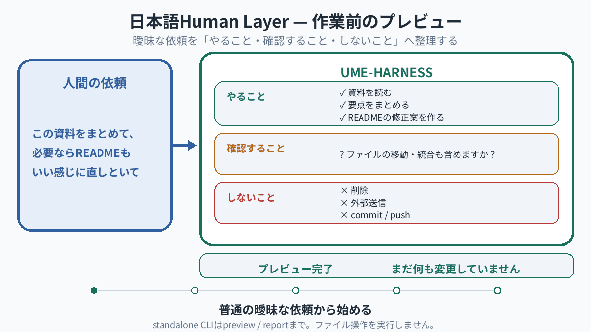
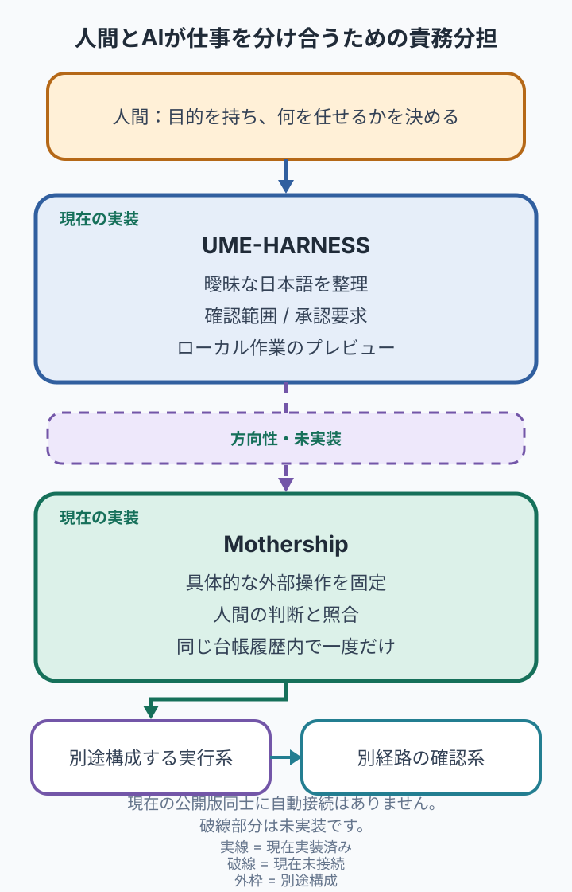
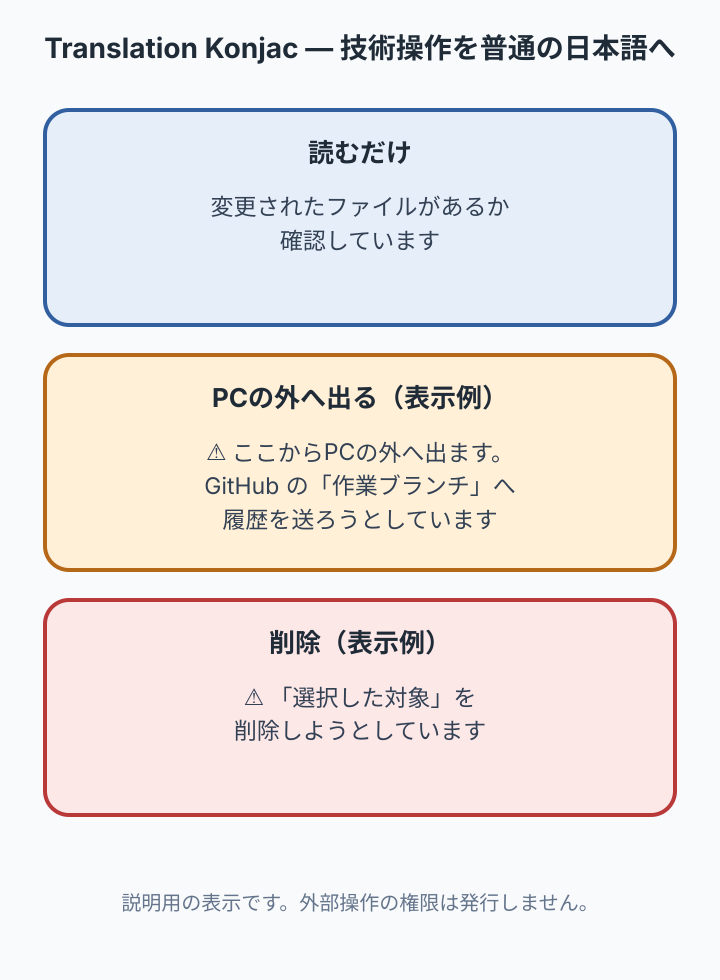

# UME-HARNESS

[English](README.en.md) · Technical Preview · [v0.1.5](https://github.com/UMEBOSHIISAN/ume-harness/releases/tag/v0.1.5)

[](https://github.com/UMEBOSHIISAN/ume-harness/actions/workflows/ci.yml)

<p align="center">
  
</p>

> 日本語で、雑に頼める。
>
> 作業へ進む前に、
> 「やること・確認すること・しないこと」を見える形にする。

UME-HARNESSは、日本語の曖昧な依頼を
範囲の決まったローカル作業へ整理する
Japanese-first Harnessです。

現在は、日本語Human Layerのpreview CLIと、
Claude Codeのlocal workを説明・制限するHost Adapterを提供します。

standalone CLIはファイル操作を実行しません。
非エンジニア向けの導入容易性は現在検証中です。

<p align="center">
  <picture>
    <source media="(prefers-reduced-motion: reduce)" srcset="assets/readme/ja/ume-harness-human-layer-poster.png">
    <source media="(max-width: 600px)" srcset="assets/readme/ja/ume-harness-human-layer-poster.png">
    
  </picture>
</p>

このGIFはstandalone CLIのpreview体験を説明するものです。
動きを抑える設定または600px以下の画面では、同じ意味の縦型静止ポスターを表示します。

## PURPOSE

人間は最初から、機械向けの完全な指示を書く必要はありません。
UME-HARNESSは、普通の日本語で受けた依頼を、AI coding agentが作業を始める前に
確認できる範囲へ整理します。

人間が全部を細かく操作するのでも、AIへ全部を明け渡すのでもなく、
今回やること、確認が必要なこと、やらないことを先に見える形にするためのローカル作業面です。

## 現在の実装

現在のreleaseには、役割の異なる二つのsurfaceがあります。

### 日本語Human Layer preview CLI

日本語の依頼を「やること / 確認すること / しないこと」に整理して表示します。
standalone CLIはpreview/reportまでで、ファイル操作を実行しません。

CLIはClaude Sonnet 5を呼ぶ構成ですが、現行releaseからraw semantic runへ到達できないため、
モデル精度を保証しません。保存済みfixtureを使うオフライン経路もあります。

### Claude Code Host Adapter

Claude Codeのlocal lease、worktree、path、capability境界を扱います。
PreToolUse、PermissionRequest、PostToolUseFailureの3 hookとLease Gateをstatic・結合テストしています。

Claude Codeは最初の統合・検証済みHost Adapterです。exact candidate bytesによるphysical live E2Eは
別の検証gateであり、このreleaseの主張には含めません。

## Mothershipとの責務分担

UME-HARNESSは人間の意図を範囲の決まったローカル作業へ整理します。
Mothershipは人間の判断を範囲の決まった外部結果へ結び付けます。

<p align="center">
  
</p>

現在の公開release同士に自動runtime bridgeはありません。破線部分は未実装です。
UME-HARNESSは外部のConsequential Authorityを持たず、Mothershipを自動で呼び出しません。

## Preview Quick Start

```bash
git clone https://github.com/UMEBOSHIISAN/ume-harness.git
cd ume-harness
./scripts/install.sh

ume-harness "このフォルダの資料まとめて、必要ならREADMEもいい感じに直しといて" \
  --context "現在の作業フォルダには資料3件とREADME.mdがあります。"
```

この通常経路には、Claude CLIの認証とネットワーク接続が必要です。
解釈のため、依頼文とcontextをClaudeへ送ります。standalone CLI自体は、
依頼されたファイル操作や外部結果は実行しません。

LLMを呼ばないオフライン確認:

```bash
ume-harness --llm-output-file <path-to-json>
```

historicalな入出力例は[examples/basic_usage.md](examples/basic_usage.md)にあります。

## 日本語で操作を説明する

Translation Konjacは、tool eventを人間向けの日本語へ言い換えるpresentation-onlyの層です。
たとえば「読む」「PCの外へ出る」「削除する」を、現在のlanguage packにある言葉で説明します。

<p align="center">
  
</p>

この表示は権限を発行せず、External Action Authorityにもなりません。
判断できない操作は、勝手に進めず確認へ戻します。

## インストールとClaude Code接続

### インストール

```bash
git clone https://github.com/UMEBOSHIISAN/ume-harness.git
cd ume-harness
./scripts/install.sh
```

デフォルトでは `~/.local` にインストールします。commandが見つからない場合:

```bash
export PATH="$HOME/.local/bin:$PATH"
```

v0.1.4からv0.1.5へ更新する場合は、新しいsource checkoutから旧releaseを検証して取り外し、
その後に新releaseをインストールします。`--force`はcross-version更新には使いません。

```bash
./scripts/uninstall.sh --version v0.1.4 --settings-path "${HOME}/.claude/settings.json" --yes
./scripts/install.sh
```

### Claude Codeへ接続・切断

Package installだけでは既存のClaude Code設定を変更しません。接続は明示的に行います。

```bash
ume-harness setup --yes
```

切断:

```bash
ume-harness setup --disconnect
```

setup/disconnectが所有するのは、setup自身が生成した3本のcanonical hook commandとの完全一致だけです。
他event、他matcher、他hookには触れません。設定を安全に解析・再検証できなければ停止します。

### 診断・アンインストール

```bash
python3 ~/.local/lib/ume-harness/v0.1.5/scripts/health_check.py
# またはrepository内から
python3 ./scripts/health_check.py

./scripts/uninstall.sh --settings-path "${HOME}/.claude/settings.json" --yes
```

custom settings pathやprefixを使った場合は、setupとdisconnect/uninstallで同じ値を指定してください。
uninstallはowned hooksとpayloadを検証し、無関係なClaude設定と `~/.ume-harness/state` を保持します。

## 現在の制約

- UME-HARNESSはOS sandboxではありません。trusted host entrypointを前提にします。
- standalone Human Layer CLIはpreview/reportのみで、ローカル作業を実行しません。
- Claude adapterのapproval-required operationを再開するconfirmation token経路は未接続です。
- expected-state、concurrent、out-of-band mutation検知primitiveはありますが、Claude host lifecycleには未接続です。
- macOS arm64のisolated lifecycleを確認済みです。Linux/POSIXはexpected/unverified、Windows nativeはunsupportedです。
- OS pseudo-fileのsecret検出は網羅的ではありません。
- identity authentication、RBAC、external executor/verifier、retry、daemonは提供しません。
- MothershipとのConsequenceProposal producerやruntime bridgeはありません。
- 非エンジニアを主要な設計対象にしていますが、導入容易性はまだ実測評価中です。

## Sourceとreleaseの境界

`ume-harness-engineering`だけがcanonical sourceです。
public `ume-harness`は明示closureから生成するrelease mirrorであり、公開側の手修正や
publicからengineeringへの逆同期はサポートしません。

機械的なrelease closureは[package_manifest.json](package_manifest.json)の `release.payload`、
表示用一覧は[MANIFEST.md](MANIFEST.md)です。`scripts/release_promote.py`はcanonicalからpublic stageへの
一方向copy、identity生成、test、mirror比較だけを行い、publishやpushは行いません。

installed payloadはfrozen byte identityで検査されます。ただしinstall provenanceは、
trusted canonical/generated-release checkoutを前提とし、独立した署名検証ではありません。

## 技術資料

- [Human Layer](ux/japanese-human-layer/README.md)
- [Claude Code adapter](adapters/claude-code/README.md)
- [Authority contract](contracts/authority_contract.md)
- [Tool policy](contracts/tool_policy.md)
- [Support matrix](SUPPORT_MATRIX.md)
- [Security boundary](SECURITY.md)
- [Release manifest](MANIFEST.md)

テスト:

```bash
python3 -m pytest -q -p no:cacheprovider tests ux/japanese-human-layer/tests
```

## License

プロジェクトのコードはMITです。詳細は [LICENSE](LICENSE) と [NOTICE](NOTICE) を参照してください。
README asset生成用に同梱するNoto Sans JPは
[SIL Open Font License 1.1](assets/readme/source/fonts/OFL-1.1.txt)です。
